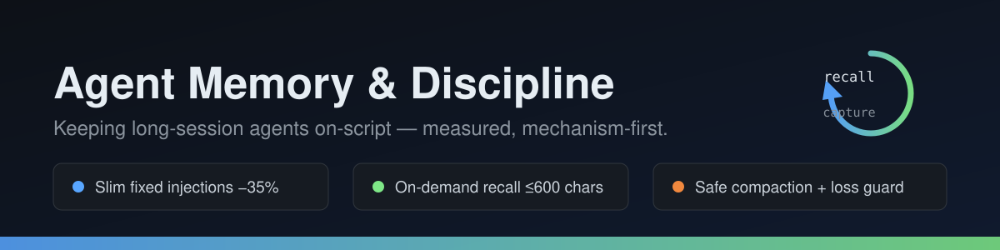
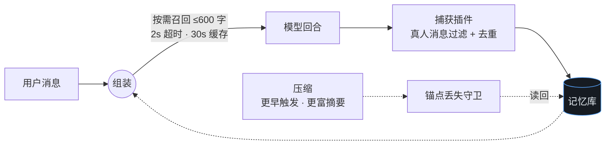

<div align="center">



[](LICENSE)


[English](README.md) | **简体中文**

</div>

> 让 LLM agent 在长会话中保持纪律的公开问题定义与设计实践。
>
> **状态：M3 已通过真实任务验收 —— M4（指标复盘与发布）进行中。**

## 一图看懂闭环



## 一句话说清问题

LLM agent 在长会话中以两种方式退化：**停止执行软性文本规则**（我们的实测：约在会话前 30% 之后逐渐归零），以及**明知记忆库里有答案、却不在决策时刻去查**——*存在 ≠ 检索到*。

## 为什么有这个仓库

我们日常在生产环境运行一个多 agent 桌面助手，上面两种失效模式都有第一手测量数据。在设计自己的方案之前，先把问题公开发出来，寻找先行工作与社区反馈。本仓库后续承载设计文档（避坑知识库 schema、强制检索钩子）与可运行的参考实现。

## 快速开始（约 1 分钟）

```bash
git clone https://github.com/lmcsh9527/agent-memory-discipline.git
cd agent-memory-discipline/lite-server
node server.mjs                 # 零依赖记忆服务，127.0.0.1:8420
curl localhost:8420/health      # {"status":"ok", ...}
```

然后按 **[SETUP.md](SETUP.md)** 接线：捕获插件 + 按需召回挂钩（DSH 桌面端或任意其他栈），
**验证捕获可靠之后**再按 playbook 收紧压缩参数。

**现在就能用 vs 需要配置**（诚实优先）：

| 内容 | 状态 |
|---|---|
| `docs/` 方法论文档（playbook / 设计 / 调研） | ✅ 今天就能在任何栈上读用 |
| `lite-server/` 独立记忆服务 | ✅ `node server.mjs` 即起，零依赖（Node ≥ 18） |
| `examples/` 捕获插件 + 召回挂钩 | 🔧 可用的参考实现——需要上面的后端 + [SETUP.md](SETUP.md) 的接线步骤 |

## 仓库结构

- `SETUP.md` — 部署指南：memory-lite vs 完整后端、插件与挂钩接线、失忆测试验收协议
- `lite-server/` — 零依赖独立记忆服务（与 TDAI 同形 API）
- `docs/problem-statement.md` — 完整公开问题定义 + 社区征询（[中文摘要](docs/problem-statement-zh.md)）
- `docs/landscape-survey.md` — 学术 + 工业界现状地图与空白点确认（M1）
- `docs/pitfall-kb-schema.md` — 结构化避坑知识库 schema（M2）
- `docs/forced-retrieval-design.md` — 「拦截即检索」钩子设计（M2）
- `docs/token-saving-playbook.md` — 记忆瘦身 + 按需召回 + 压缩协同三板斧，含实测数字（M4）
- `examples/token-saving/` — 捕获插件参考实现 + 召回挂钩样例（已脱敏）
- `docs/roadmap.md` — M1–M4 里程碑

## 核心概念

- **规则执行衰减** — 软性文本规则在会话早期被遵守，之后逐渐失效。
- **有库不查** — 存储存在，但关键时刻检索动作从未触发。
- **强制检索接入点**（「拦截即检索」）— 用硬机制让「高危操作前必查已知坑库」成为强制动作。

## 向社区请教

见 [`docs/problem-statement.md`](docs/problem-statement.md)。我们特别想找：

1. 在**决策点强制检索**（拦截 + 必查）方向的先行工作。
2. 能让**规则执行活过 10 万 token 会话**的机制，最好带实测数据。
3. **纪律衰减与检索触发正确性**的度量方法 / 基准。
4. **非编程场景**长程 agent（创作、多 agent 协作、运维）保持按剧本执行的实践经验。

## 路线图

| 里程碑 | 内容 | 状态 |
|---|---|---|
| M1 | 问题定义与现状调研 | ✅ 2026-08-20 |
| M2 | 设计：避坑库 schema + 强制检索钩子交互 | ✅ 2026-08-20 |
| M3 | MVP：真实任务验证 | ✅ 2026-08-20（反复踩坑任务 40 分钟 → 10 分钟） |
| M4 | 指标复盘与发布（插件 / 独立项目） | 🚧 进行中 |

## 许可证

[MIT](LICENSE)
